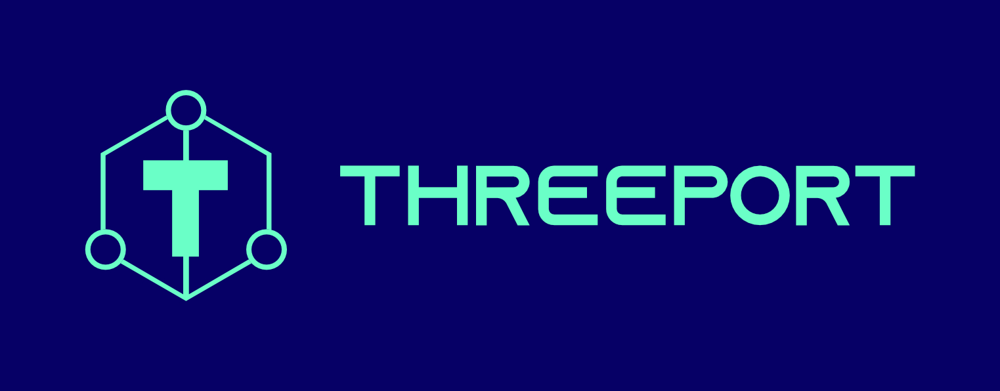

An application orchestration control plane.

Threeport exists to provide useful abstractions for running applications and
their dependencies.  The threeport control plane orchestrates the workloads that
comprise your applications by treating the following as app dependencies:
* Infrastructure: Threeport provisions and manages infrastructure as a dependency
  of your app.  Infrastructure that is used by your app is not provisioned until
  you instruct threeport to deploy your workloads.
* Kubernetes: Using threeport, you no longer have to install and manage
  Kubernetes clusters.  It is done for you by threeport at application runtime.
  Kubernetes provides container orchestration and serves as the runtime environment
  for threeport workloads.  We aim to relieve you and your software delivery systems
  of the need to use `kubectl` or interact with the Kubernetes API when deploying
  your apps.  Threeport will manage as many clusters as your requirements dictate
  without you having to develop your own Kubernetes federation system.
* Support Services(coming soon): Applications running in Kubernetes require
  cluster support services that are installed on Kubernetes to serve the
  workloads that run there.  This includes things like ingress request routing,
  TLS asset management, DNS record management, secrets management, log
  aggregation, monitoring, etc.  Threeport will install these support services
  and configure them for your app as needed.
* Managed Services(coming soon): Many applications use cloud-provider managed
  services such as databases and object storage buckets as dependencies.  With
  threeport you can declare those dependencies and those services will get
  provisioned for your workloads at runtime.
* Workloads: In addition to your primary user-facing application deployments,
  threeport manages any services you build in-house as a part of a distributed
  architecture (microservices).  These are declared as workload dependencies and
  can be nested as your requirements dictate.

In summary, threeport provides a global control plane for your application
deployments using battle-tested designs and best practices so you can trust that
your software will run reliably.  This frees you to concentrate on develivering
value to your users.

User documentation can be found on our [user docs site](https://docs.threeport.io/).

Developer documentation can be found [here](docs/README.md).

## Note

Threeport is not yet production-ready.  It is in alpha stage development and APIs
may change without notice.  Do not build any integrations with the threeport API
that are used for critical systems.  In the near future, APIs will stabilize
and guarantee backward compatibility.  Additionally, there are security concerns
and observability systems which are crucial for production that are not yet implemented.

## Managed Threeport Providers

[Qleet](https://qleet.io) provides a fully managed threeport service that
lets teams deliver their software into their own cloud provider accounts using
Threeport.

