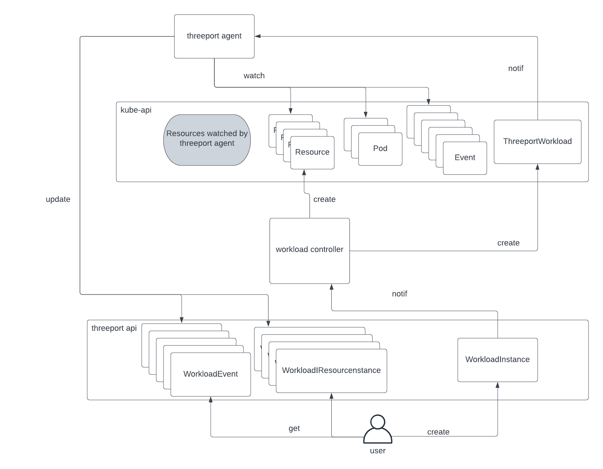

# threeport-agent

The threeport-agent is a Kubernetes Operator that runs in each cluster managed
by Threeport and provides a feedback loop on Kubernetes resources in the run
time clusters.

Its primary purpose is to send information back to the Threeport API so that:

* users can retrieve information about their workloads for visibility and
  troubleshooting
* controllers in the Threeport control plane can leverage that information as
  needed

The following diagram illustrates its function.

The flow of operations is as follows:

1. The user at the bottom of the diagram creates a WorkloadInstance.

1. The workload controller is notified and creates the necessary Kubernetes
   resources to fulfil that workload.

1. The workload controller additionally creates a ThreeportWorkload resource
   which is the custom Kubernetes resource used by the threeport-agent.  The
   workload controller populates the ThreeportAgent resource with information
   about the resources and related objects in the ThreeportAPI so the
   threeport-agent knows which resources to watch.

1. The workload controller also adds some labels so the threeport-agent can find
   the Pod and ReplicaSet resources that aren't directly created but important
   to managed worklaods.

1. The threeport-agent uses this information to find the Event resources related
   to all these managed resources.

1. The threeport-agent sends this information back to the Threeport API to
   update WorkloadResourceInstances and create new WorkloadEvent resources
   associated to the right workload objects.

