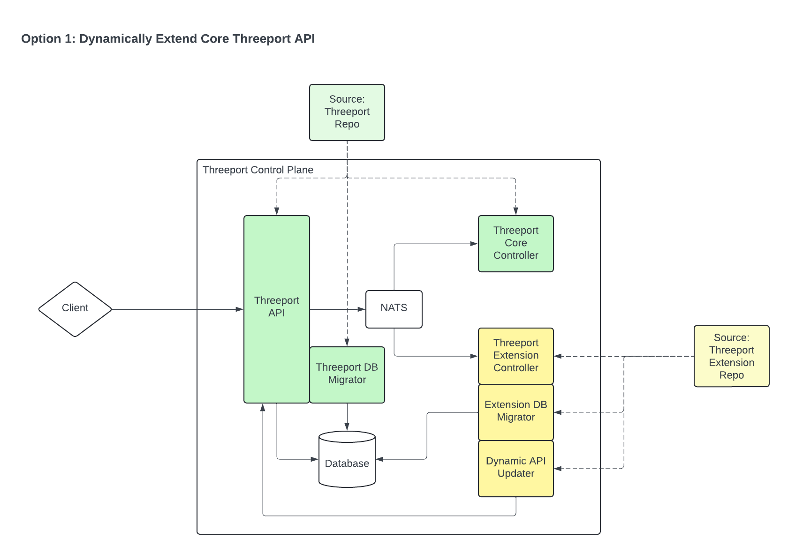
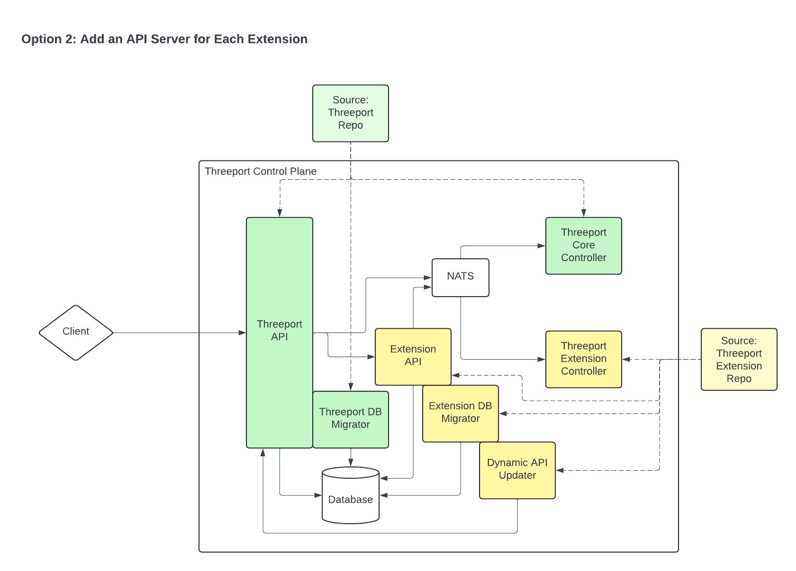

# Threeport Extensions

This document outlines design decisions for the Threeport extensions developed
using the Threeport SDK.

## Control Plane Extension

Requirements:

* The Threeport SDK must support extensions that are developed in their own repo,
  outside the threeport/threeport repo and added to running Threeport control
  plane.
* Any number of Threeport extensions must be able to be added that are unknown
  at the time the core Threeport control plane is deployed.

Implications:
* We will need to provide a namespacing mechanism in the Threeport API that
  prevents naming collisions between API objects.
  e.g. if two extensions that are used in the same control plane include an
  object called `FancyWorkload`, the API route path will collide.  They will both
  be `[base]/v1/fancy-workload`.  If each extensions contains a namespace
  prefix, naming collisions are prevented.  Since theses are esssentially global
  namespaces, we should use domain names for global uniquenss.
  e.g. `[base]/acmecorp.com/v1/fancy-workload` and
  `[base]/fancy.com/v1/fancy-workload`.
* The Threeport API database schema must be updated to include objects for the
  extension.
* The Threeport API itself must be extended with routes, handlers, NATS
  subjects, etc. to handle incoming requests for extension objects.

### Option 1: Dynamically Extend Core Threeport API

The first option is to include a dynamic API updater with each extension that
calls an endpoint on the Threeport API to instruct it of all the elements that
need to be added (see above impliciations) to manage extensions objects.

In this diagram, the Threeport Extension Controller is deployed with two init
containers:

1. Extension DB Migrator calls the database to update the schema for the new
   object.
2. Dynamic API Updater calls the Threeport API with instructions and parameters
   to handle the extension's objects.

Pros:

* The runtime environment of the extended Threeport control plane is minimally
  extended.  Only one pod for the Threeport extension controller is added to the
  control plane.

Cons:

* The process of adding all the logic to the core Threeport API is very complex.
  Adding custom logic for things like pre-create gorm hooks will be quite
  challenging.

### Option 2: Add an API Server for Each Extension

The second option is to add a dedicated Extension API.  The Threeport API
proxies all requests for that object to the Extension API which has its own DB
migrator with the same design architecture as the core Threeport API.  The
Extension API registers the necessary routes with NATS (naming collisions could
be a problem here as well) and sends notifications using the same system as the
core Threeport API.

In this diagram, a dedicated Extension API is added.  The DB migrator and API
updated are init containers on that Extension API pod.  The DB schema is updated
when deployed and the Dynamic API updater calls the Threeport API to inform it
which route prefixes should be proxied to which endpoint.

Pros:

* The logic required for dynamic API updates to the core Threeport API is
  greately simplified.  Only the routes to proxy and the proxy destination are
  needed.
* The implementation of this in the Threeport Extension Repo is greatly
  simplified.  API server code generation in the SDK can leverage much of the
  same code as core Threeport for API server code gen.

Cons:

* An additional API Server deployment is needed for every extensions added to
  the Threeport control plane which adds to delivery and management overhead of
  the Threeport control plane with extensions.

