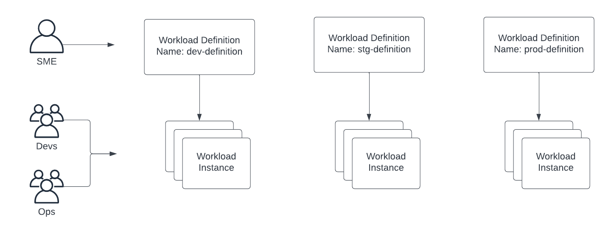
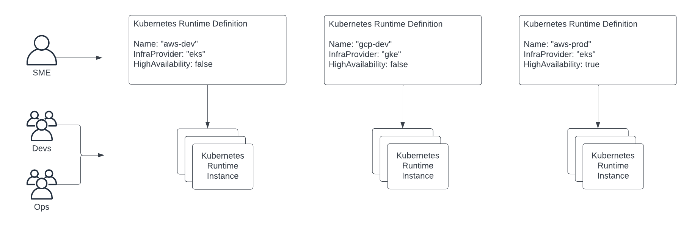

# Definitions & Instances

API objects that represent deployable workloads are separated into two distinct
object types: definitions and instances.

Definitions represent configurations that will be identical across multiple
deployments.  Instances include values that constitute deploy-time
configurations that will be commonly changed.

Instances derive their configuration from definitions.  This allows multiple
instances with a particular configuration to be readily deployed.

The result is that subject matter experts can define the configuration for
different variants of a workload, then developers and operations personnel can
manage instances derived from those definitions.

When designing the data model for your APIs, its important to consider
whether a field that controls workload attributes should be in the definition
or the instance object.  The following guidelines are to help with this.

## Definitions

Definitions should include fields that allow users to create commonly used
configurations.  Each different configuration will represent a distinct use case
that may be re-used as many tims as needed.

For example, a workload definition includes the Kubernetes manifest that
configures the Kubernetes resources needed to run some workload.

A Kubernetes runtime definition includes node sizes and the maximum number of
nodes allowed per Kubernetes cluster.

## Instances

Instances should include fields for config variations particular definitions.
These will be commonly varying values for commonly used configurations.
Instances should also include fields to store runtime information about the
deployed instances.

For example, a workload instance allows the user to specify which Kubernetes
runtime a workload will be deployed to.  It also stores status information about
the important Kubernetes resources - such as pods, as well as important events
related to the instance.

A Kubernetes runtime instance includes a location field that allows the user to
choose which cloud provider region a Kubernetes cluster should be spun up in.
It also stores information about the Kubernetes API, including credentials to
connect to it.

## Field Determination

An imporant design decision is whether to put a particular field in the
definition or the instance.  For example, a Kubernetes runtime definition
includes an `InfraProvider` field that allows the user to nominate which cloud
provider to use for hosting a Kubernetes cluster.  This could conceivably be put
in the instance object so that a definition with particular node sizes and profiles
could be deployed to any infra provider - as defined at the instance level.  We
chose to include the `InfraProvider` field in the definition as this is a
fundamental configuration characteristic in that different cloud providers offer
different features and services.  In contrast, the region to which a Kubernetes
cluster is deployed could more commonly change and is less fundamental to the
configuration.

This allows the following kind of use case where a team that needs a cluster
spun up can choose from the following definitions that are assembled by an SME
on the platform team.  The team's that create the instances can use the
definition that fits their purpose and determine which cloud provider region
they wish.

## Usability

The end user of Threeport will most often be managing instances of the thing
they need.  Where possible reduce the number of required fields in the instance
object.  If you accumulate many required fields, assess whether some of the
fields could be moved to the definition or defaulted.

## Summary

* If an object attribute is likely to be consistent across many different
  instances, the field that controls that attribute should likely be in the
  definition.
* If there are many differnt choices for an attribute, it should likely be in
  the instance, as putting it in the definition will often lead to a sprawl of
  many different definition choices.
* If an attribute will often vary depending on the use case, it should likely be
  in the instance object so that users can define it when they deploy.

