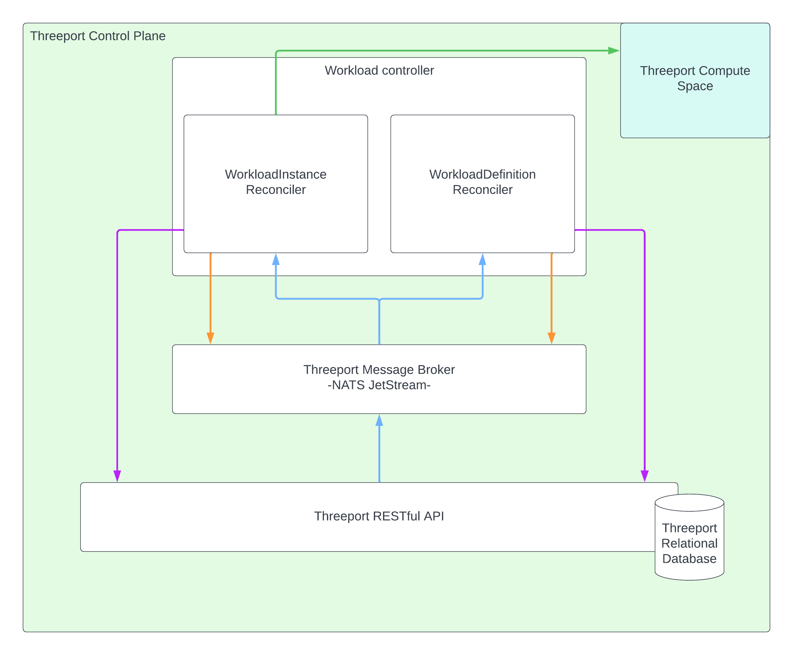

# Threeport Controllers

Threeport controllers perform state reconciliation in the system.  When a user
deploys a workload, a change is made to the data store through the Threeport
RESTful API.  Once that change has been successfully persisted, the API
notifies the appropriate controller via the notification broker.  The Threeport
controller responsible for deploying the workload then executes the action and
updates the status of the object in the API.

The following diagram illustrates this process for the workload controller as an
example.

1. A developer requests a workload by sending a request to the API, usually
   using the CLI tool `tptctl`.
1. The API validates the request and then stores the workload objects'
   configuration values in the database.
1. Once persisted, the API notifies the message broker of the change, including
   the database ID of the objects in question.
1. The message broker delivers the notification to the correct Threeport
   controller.  If no Threeport controller is available immediately due to load
   or temporary outage, the NATS Jetstream broker holds the message until a
   Threeport controller instance becomes available.
1. The Threeport controller puts a lock on the specific object by type and
   unique ID.  That way if another change is made to the same object before
   reconciliation is complete, the first change is completed and then the second
   change is executed so that race conditions don't develop.  In the event that
   a reconciliation cannot be completed, such as when a lock exists on a
   particular object, the notification is re-queued through the broker so that it
   is performed at a later time.
1. Reconciliation is completed.  In this case, the workload is deployed by
   calling the Kubernetes API of the target cluster for the workload.
1. Once the operation is successfully reconciled, the Workload controller
   updates the status of the object through the API.
1. Finally, the Threeport controller releases the lock on the object instance so
   that it may undergo any future reconciliation.

## Reconcilers

To drill into a little more detail, a Threeport controller internally consists
of one or more reconcilers.  Each reconciler is responsible for the state of a
single object type.  To continue the example above, two objects were created by
the developer.  A WorkloadDefinition and a WorkloadInstance.  The
Workload controller has a distinct reconciler for each object.

> Note: this illustration does not include an exhaustive list of reconcilers in
> the Workload Controller.  It is just a representation of the components involved
> in the example from above.

The blue arrows illustrate the notifications that are sent to the reconcilers
when a change occurs in the system.

The orange arrows represent the communication from the reconcilers to the
message broker.  They first check to see if a lock exists on a particular object
before reconciling.  If no lock is found, they place a lock and reconcile.  If a
lock is found, they re-queue the notification - usually after some short period -
so that reconciliation can occur at a later time if needed.  Once reconciliation
is complete, the lock is released.

The green arrows show the calls from the reconcilers to the Kubernetes API in
the Compute Space.  The Kubernetes API provides the primary interface point for
the reconcilers to the compute space.  No calls are made into processes or
workloads in those clusters as a rule.  Any custom operations that are not
satisfied by Kubernetes are achieved with custom Kubernetes operators that can
be configured and triggered through the Kubernetes API.

The purple arrows show the calls back to the API to update other related objects
or write the status of the object reconciled.

