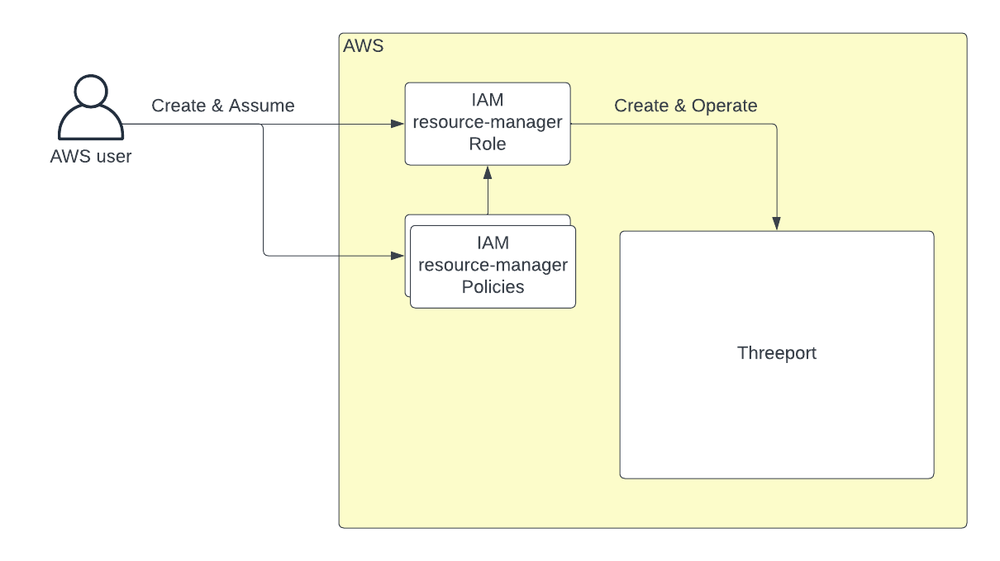

# AWS Permissions

Before standing up a Threeport control plane in AWS using the `eks`
provider, ensure you have the required IAM permissions set for your AWS user.

To install Threeport using `tptctl up`, an AWS user first creates a new "resource-manager" role
and two policies for that role.  The AWS user then assumes that role in order to
create and operate Threeport.  Therefore an AWS user needs the following
permissions to install and manage Threeport:

* Create and manage IAM roles
* Create and manage IAM permissions
* Assume that role for installing Threeport



If you don't have those permissions, you will need someone else on your AWS
account to grant you that access.  The following instructions are for that user
on AWS to grant access to another user to manage Threeport installations.

## Threeport Resource Manager Permissions

To see the permissions available to the resource-manager role that manages
Threeport, see the
[AssumeAnyRolePolicyDocument](https://github.com/threeport/threeport/blob/main/internal/provider/eks.go#L678-L688)
and
[ResourceManagerPolicyDocument](https://github.com/threeport/threeport/blob/main/internal/provider/eks.go#L689C2-L830)
in the Threeport source code.

## Prerequisites

The instructions below require:

* The [AWS CLI](https://aws.amazon.com/cli/) installed and configured to access
  your account.
* The [jq](https://jqlang.github.io/jq/) command line json parsing tool.

## Set Environment Variables

Following are the values we will need to set up access for another user to
manage Threeport.

Set the user name for the user being granted access to manage Threeport:

```bash
export THREEPORT_ADMIN_USER_NAME=<aws user name>
```

Set your AWS account ID:

```bash
export AWS_ACCOUNT_ID=<aws account id>
```

Set the names of the group and policy for Threeport admins.  These are arbitrary
and can be changed:

```bash
export THREEPORT_ADMIN_POLICY_NAME=ThreeportAdmin
export THREEPORT_ADMIN_GROUP_NAME=threeport-admin
```

## Create a Threeport Admin Policy

The following command will generate the policy document for your ThreeportAdmin
users and write it to your working directory.

```bash
cat <<EOF > threeport-admin-iam-policy.json
{
    "Version": "2012-10-17",
    "Statement": [
        {
            "Sid": "AssumeAnyThreeportResourceManager",
            "Effect": "Allow",
            "Action": "sts:AssumeRole",
            "Resource": "arn:aws:iam::${AWS_ACCOUNT_ID}:role/resource-manager-threeport-*"
        },
        {
            "Sid": "CreateRolePermissions",
            "Effect": "Allow",
            "Action": [
                "iam:CreatePolicy",
                "iam:DeletePolicy",
                "iam:ListPolicies",
                "iam:CreatePolicyVersion",
                "iam:DeletePolicyVersion",
                "iam:SetDefaultPolicyVersion",
                "iam:GetRole",
                "iam:CreateRole",
                "iam:DeleteRole",
                "iam:UpdateRole",
                "iam:PutRolePolicy",
                "iam:DeleteRolePolicy",
                "iam:AttachRolePolicy",
                "iam:DetachRolePolicy",
                "iam:TagRole",
                "iam:UntagRole",
                "iam:ListAttachedRolePolicies",
                "iam:TagPolicy",
                "iam:UpdateAssumeRolePolicy"
            ],
            "Resource": [
                "arn:aws:iam::${AWS_ACCOUNT_ID}:role/resource-manager-threeport-*",
                "arn:aws:iam::${AWS_ACCOUNT_ID}:policy/resource-manager-threeport-*"
            ]
        }
    ]
}
EOF
```

Create the policy in AWS and capture the policy ARN:

```bash
export THREEPORT_ADMIN_POLICY_ARN=$(\
    aws iam create-policy \
        --policy-name $THREEPORT_ADMIN_POLICY_NAME \
        --policy-document file://threeport-admin-iam-policy.json \
        --description "Create Threeport resource manager role and policy, allow assumption of the resource manager role" \
    | jq -r '.Policy.Arn')
```

## Create a User Group

Create a group for managing Threeport instances:

```bash
aws iam create-group \
    --group-name $THREEPORT_ADMIN_GROUP_NAME
```

## Attach Policy to User Group

```bash
aws iam attach-group-policy \
    --group-name $THREEPORT_ADMIN_GROUP_NAME \
    --policy-arn $THREEPORT_ADMIN_POLICY_ARN
```

## Add Threeport Admin User to the User Group

```bash
aws iam add-user-to-group \
    --group-name $THREEPORT_ADMIN_GROUP_NAME \
    --user-name $THREEPORT_ADMIN_USER_NAME
```

You can now add more users to that group if need be:

```bash
export THREEPORT_ADMIN_USER_NAME=<another aws user name>
aws iam add-user-to-group \
    --group-name $THREEPORT_ADMIN_GROUP_NAME \
    --user-name $THREEPORT_ADMIN_USER_NAME
```

## Clean Up

Remove the Threeport admin policy document file:

```bash
rm threeport-admin-iam-policy.json
```

