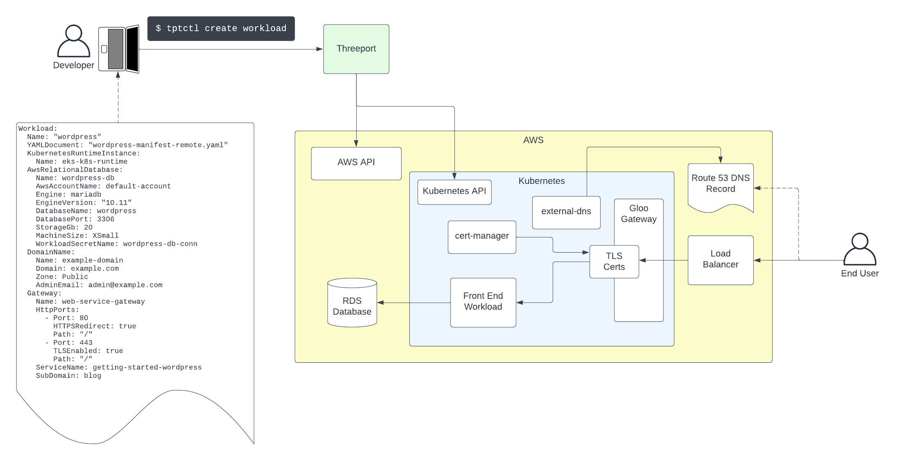
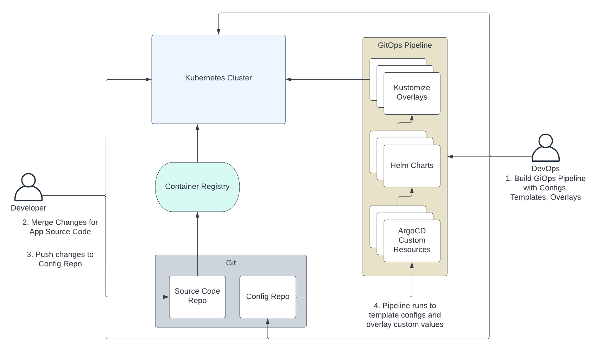
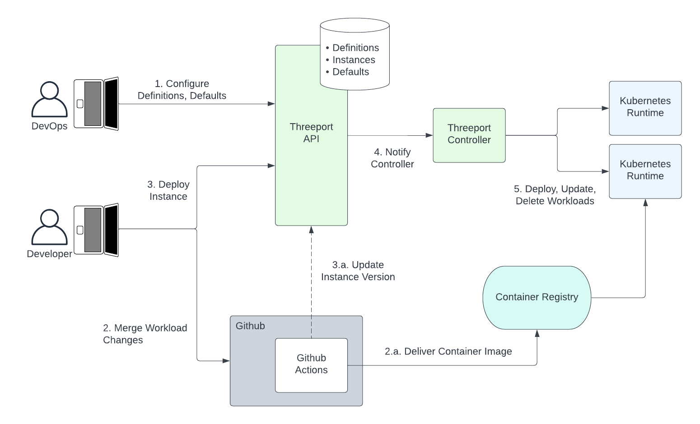

# Application Orchestration

App Orchestration is a programmatic approach to software delivery
that facilitates the use of software systems to manage the deployment and
ongoing management of apps.

This is the approach used with Threeport.  Applications don't exist in a vacuum.
They have dependencies.  Threeport manages all the dependencies for an
application so that a development team can start with absolutely no
infrastructure or runtime environment and readily deploy their application using
Threeport.

Threeport treats the following concerns as application dependencies:

* Cloud Infrastructure: Threeport orchestrates the provisioning, availability
  and autoscaling of all compute and networking infra needed to run an
  application.
* Container Orchestration: Kubernetes is the most capable runtime environment
  for cloud native software.  Threeport installs and configures Kubernetes
  environments for the application being deployed.
* Support Services: Applications need support services installed on Kubernetes
  to provide things like network connectivity, TLS termination, DNS record
  management, secrets, metrics and log aggregation.  Threeport installs and
  configures these support services for each application deployed.
* Managed Services: Many applications use cloud provider and/or commercial
  managed services such as databases or observability services as a part of
  their stack.  Threeport orchestrates the provisioning and connectivity for
  the application's workloads to make these managed services available.

The ultimate end-user of Threeport is the developer or operator that needs to
deploy and manage instances of their applications - for development, testing,
staging or production. The user provides a config for their app that declares
its dependencies.  Threeport orchestrates the delivery of the application
workloads along with all their dependencies.

## Continuous Delivery & GitOps

For comparison, let's look at common methods that have been used for software
delivery in the past.

CD and GitOps are primarily adaptations using CLI tools that humans use.  They
were an improvement on run books used by system admins in days gone by, and they
served us well for a time.  However, their shortcomings are glaring.

Tools like Terraform, Helm and Kustomize are not natively interoperable.  They
require vast text file configurations and do not handle logical constructs well.
Hashicorp did its best to introduce conditionals and loops to Terraform.  The go templating
used by Helm is similarly capable.  These methods are fine for early testing and
development.  However, when complex production environments grow from those early
POCs and MVPs, these config languages and templating systems fall short.  Any
web developer will tell you that logic should be kept out of the templates that
render HTML as much as possible.  There's a good reason for this: templating
languages are limited, difficult to maintain and much more challenging to write
unit and end-to-end tests for.

Below is a diagram that illustrates a pretty typical use of GitOps.

1. Ahead of time, the GitOps team builds the GitOps pipeline which generally
   includes Helm templates and Kustomize overlays.  The pipeline itself also must
   be configured.  A popular choice is ArgoCD and, in that case, the pipelines
   are configured using their Kubernetes custom resources.
1. The developer merges changes to their application which fires off a
   continuous integration process to test and build their app.  The end result
   is a container image pushed to a registry.
1. The developer pushes a change to the config repo.  This would include an
   update to the version of the container image they wish to deploy.  They would
   usually apply that change to the branch or set of configs that correspond to
   the environment they wish to deploy to.
1. The GitOps pipeline is triggered by the change and runs the templating and
   overlay operations to render complete Kubernetes manifests that are then
   applied to the cluster.

This GitOps workflow can work fine in simple use cases.  The problems arise
as sophistication increases.  Helm templates often become overwhelmed with
conditional and looping logic that is messy to express in templating languages.
The additional complexity of multiple layers of configuration with Helm and
Kustomize make it challenging just to figure out where values are being set.
And since such pipelines are difficult to test before use, they tend to be
brittle and interrupt day-to-day operations.

This complexity is compounded when using multiple inter-dependent workloads in a
microservices architecture.  The configuration to connect those components must
be supplied as inputs to the pipeline, adding more config vars that apply in
multiple places inside a maze of templates, overlays and configs.

The complexity is increased further if there are controllers in your system that update
resource configurations that have been defined in a config repo.  You then have
to either tell your GitOps engine to ignore some changes or push those changes
back into the code repo from your runtime environment.

In summary, GitOps is OK early in early development.  However, it becomes entirely
inelegant as complexity scales up - as it inevitably does when the realities of
production hit and as requirements for your software accumulate.

## Software Delivery Orchestration with Threeport

In contrast to config languages and templating languages, general purpose
programming languages like Java, Python and Go are designed to
manage complex logic elegantly.  Logic defined in these languages is
maintainable and can have comprehensive automated testing applied to maintain reliability
and backward compatibility.  They are great for writing APIs that enable further
software interoperability.

We chose Go to build Threeport.  It exposes a RESTful API that can be called
through our CLI `tptctl` or by any application that can call an API over HTTP.  It stores
state in a relational database and uses controllers to reconcile state for
objects defined by users.

You no longer have to manage thousands of lines of config in a git repo that
triggers pipelines.  Threeport is an application that manages the delivery of
your workloads.  It orchestrates all of your app's dependencies in a cloud
native environment, all the way down to the infrastructure.

Threeport manages software delivery in these distinctly different ways from
pipeline-driven systems:

* The developers and DevOps team don't store their configs and templates in git.
  We view git as an excellent tool for version control of source code for
  applications, but not as a data store for system configuration.  Threeport
  stores user-defined config in a database so that controllers in the system
  can readily read those configs and update them with statuses and other information
  collected at deploy and run time.
* Configs are not processed through a pipeline.  When configuration is added,
  updated or removed, level-triggered controllers are notified of the change and
  set about reconciling the user-defined state with the actual state of the
  system.  They operate on a non-terminating loop until the desired state is
  reached.
* Threeport enables the use of custom controllers to provide customized
  functionality.  While Threeport supports the use of Helm and Terraform for
  those that want to start with those methods, we encourage the use of the
  [Threeport SDK](../sdk/sdk-intro.md)
  to build controllers that understand each particular custom use
  case.  These controllers can be maintained with unit tests and
  end-to-end tests.  Rather than templates with placeholders, software uses objects with
  variable substitution.  Values for those variables can be passed as parameters
  into functions that and are naturally subject to more rigorous controls.
* Threeport is a natively multi-cluster system.  Many organizations use multiple
  clusters across different tiers and environments.  This allows Threeport to
  perform actions that take these clusters, tiers and environments as input
  configurations.  Logic can be implemented for multi-cluster systems to enable
  the orchestration of advanced disaster recovery, failovers, migrations and
  multi-region applications in a coherent, reliable and scalable way.

The following diagram illustrates software delivery using app orchestration with
Threeport.

1. Ahead of time, the DevOps team sets up definitions and defaults for apps
   and their dependencies.  These provide the guardrails and rules leveraged
   by the developer to deploy instances.
1. The developer merges changes that trigger a CI process using, for example,
   GitHub Actions.  This typically runs automated tests and build processes.
    1. The final build artifact is generally a container image that is pushed to an
       image registry to become available to run in an environment.
1. The developer can now trigger a deployment of an instance of that
   application.
    1. In the near future, updates from GitHub Actions will be available.  This
    will change the image version to trigger automated updates when desired.
1. The Threeport control plane notifies a controller to perform a deployment or
   update to the running containers and Kubernetes resources necessary to
   achieve the desired state.  This enables future behavior to automate roll
   outs in some tiers, e.g. dev, while ensuring that human operators can trigger
   roll outs for more critical tiers like staging and production.
1. Any deployments, updates and deletes are then conducted by the Threeport
   controller by calling the relevant Kubernetes API running in the environment
   being used.

Subsequently, the developer and other team members can then retrieve status
updates and operational data - including any errors - for the new deployment
through the Threeport control plane.

## Summary

Software delivery orchestration uses a control plane to manage application
deployment and management.  It scales well with complex software systems that
have many dependencies on infrastructure and other services.

Cloud native systems were enabled by container orchestration with Kubernetes.
It alleviated the need to use config management with tools like Ansible, Chef
and Puppet because a control plane took responsibility for reconciling state
across clusters of machines.  Software delivery orchestration removes the need
to use config tools to define our applications and their dependencies
because a control plane becomes responsible for stitching all these elements
together to produce a running app.

## Next Steps

To get a practical understanding of how Threeport manages delivery, check out
our [Getting Started page](../getting-started.md) which provides the steps to
install Threeport and use it to deploy a sample application.

