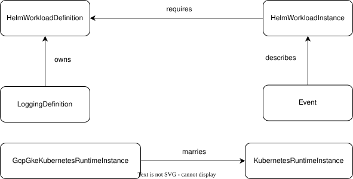

# Attached Object References

In Threeport, relationships between objects can be defined that go beyond simple foreign key references.

## Base Object

The **base object** is the object being attached to.  The `ObjectType` in an `AttachedObjectReference` is the type (as a string) of the base object.

The **attached object** is the object that is being attached.  The `AttachedObjectType` in an `AttachedObjectReference` is the type (as a string) of the attaching object.

The following table provides examples of base and attached objects.

| Base Object | Attached Object |
|-------------|-----------------|
| `HelmWorkloadDefinition` | `HelmWorkloadInstance` |
| `HelmWorkloadDefinition` | `LoggingDefinition` |
| `HelmWorkloadInstance`   | `Event` |

## Incoming vs Outgoing References

Once two objects are linked by an `AttachedObjectReference`, each side sees the link from a different perspective. The vocabulary used in the codebase:

- An **incoming reference** is a reference *toward* an object on its base side. From the base object's point of view, all `AttachedObjectReference` rows where it appears as `ObjectType`/`ObjectID` are incoming. These are what block delete (or update, depending on relationship) of the base object.

- An **outgoing reference** is a reference *from* an object on its attached side. From the attached object's point of view, all `AttachedObjectReference` rows where it appears as `AttachedObjectType`/`AttachedObjectID` are outgoing. These are what get cleaned up when the attached object is deleted.

For example: if `HelmWorkloadDefinition` (base) is linked to `HelmWorkloadInstance` (attached) via a `requires` reference, the `HelmWorkloadDefinition` sees one incoming reference and the `HelmWorkloadInstance` sees one outgoing reference. Both views point at the same row in the `v0_attached_object_references` table.

## Relationships

### Requires Relationship

There are cases where one object **requires** the existence of another for important information.  For example, a `HelmWorkloadInstance` **requires** a corresponding `HelmWorkloadDefinition` for configuration information.  The `HelmWorkloadDefinition` cannot be deleted while any attached `HelmWorkloadInstance` objects still exist.  A `HelmWorkloadInstance` is meaningless without the `Repo` and `Chart` which are defined in the `HelmWorkloadDefinition`.

In a **requires** relationship, the base object cannot be deleted while any attached object exists.

### Owns Relationship

There are other cases where the reconciliation of state for one object creates another object.  For example, when a `LoggingDefinition` is created, its reconciler will create one or more `HelmWorkloadDefinition` objects.  The configuration of the `HelmWorkloadDefinition` is driven by the configuration of the `LoggingDefinition`.  The `LoggingDefinition` **owns** the `HelmWorkloadDefinition` because the configuration of the `LoggingDefinition` informs the config of the `HelmWorkloadDefinition`.  The `LokiHelmValuesDocument` in the `LoggingDefinition` provides the `ValuesDocument` for the owned `HelmWorkloadDefinition`.

In an **owns** relationship, the base object cannot be updated or deleted while any attached object exists, except by the controller registered for the attached object's type. An owned base has at most one owner; an owner may own many bases.

### Marries Relationship

A **marries** relationship is the strict 1-to-1 form of an owns relationship. Both sides are partnered exclusively: the base appears in at most one marries reference, and the attached side does too. Updates and deletes to the base are blocked for any caller except the partner controller, same as owns. The 1-to-1 cardinality is enforced by partial unique indexes on the reference table.

### Describes Relationship

If an object provides information about another object, it **describes** that object.  For example, an `Event` object records information that occurs at a point in time about a `HelmWorkloadInstance` object.  The `HelmWorkloadInstance` is the base object.  The `Event` object is the attached object.  If the `HelmWorkloadInstance` is updated or deleted, the `Event` object can still exist independently without negative impact.

In a **describes** relationship, the base object can be updated or deleted while the attached object exists.

The following table illustrates the relationship type for each example.

| Base Object | Attached Object | Relationship |
|-------------|-----------------|--------------|
| `HelmWorkloadDefinition`      | `HelmWorkloadInstance`              | `requires` |
| `LoggingDefinition`           | `HelmWorkloadDefinition`            | `owns` |
| `KubernetesRuntimeDefinition` | `AwsEksKubernetesRuntimeDefinition` | `marries` |
| `HelmWorkloadInstance`        | `Event`                             | `describes` |


<br><br>
*Each row in `v0_attached_object_references` ties one base object to one attached object through a relationship.*


## Attachment

Attachments are persisted as rows in the `v0_attached_object_references` table. Each row carries:

- `ObjectType` + `ObjectID` - the base side (the polymorphic "what is being attached to")
- `AttachedObjectType` + `AttachedObjectID` - the attached side
- `Relationship` - one of `requires`, `owns`, `marries`, `describes`

Type fields are stored in fully qualified form: `<api-namespace>/<version>.<TypeName>`. Core types use `threeport.io` as the namespace; modules use their own configured `ApiNamespace`.

## Data Model Tags & SDK

In the API definition, a foreign key relationship can have a `relationship` struct tag applied.

This informs the Threeport SDK about the nature of the relationship, and the SDK will generate the necessary code for the gorm hook.

> Note: The gorm hooks can be hand written to enforce relationships, however it is strongly recommended to define it on the data model and let the SDK generate the code.  In this way, it is clear on the data model what relationships exist.

For example, a `HelmWorkloadInstance` requiring a `HelmWorkloadDefinition` is expressed by tagging the foreign-key field:

```go
type HelmWorkloadInstance struct {
    Common `swaggerignore:"true" mapstructure:",squash"`

    // ...

    HelmWorkloadDefinitionID *uint `relationship:"requires"`
}
```

At generation time, the SDK emits a `RelationshipTaggedForeignKeys()` method that returns the tagged FKs, which the runtime hooks consume to insert/update/delete the appropriate `AttachedObjectReference` rows.
