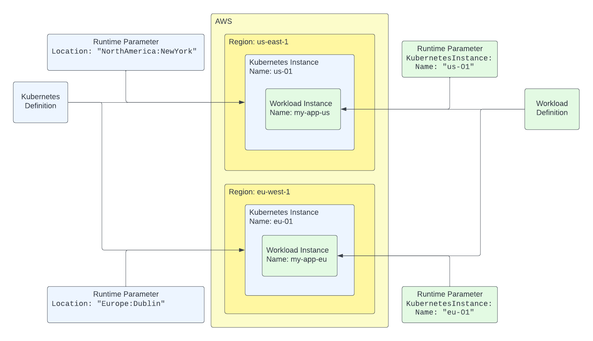
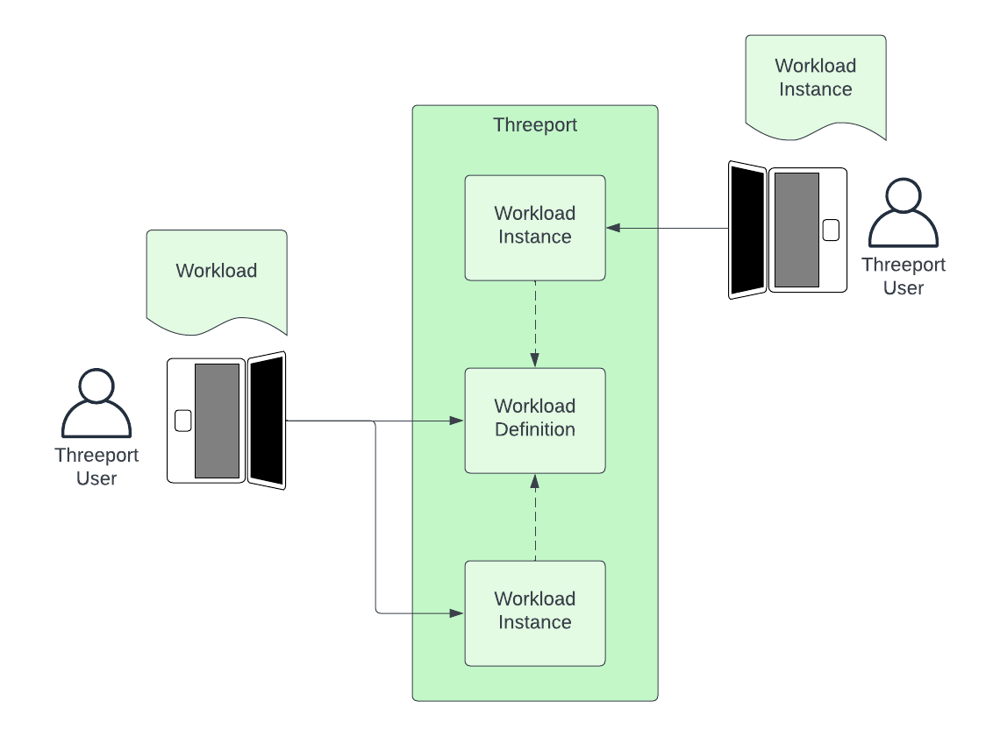

# Definitions & Instances

Most objects in Threeport are broken into two parts:

* Definition: This holds the configuration of attributes for an object.
* Instance: A deployed instance of the configuration with a limited number of
  runtime parameters.

You can deploy any number of instances for a definition.  This diagram provides
two examples:

A Kubernetes Definition provides the configuration for a Kubernetes cluster.
This includes attributes such as the cloud provider to run on, the node sizes and
types to use as well as the maximum number of nodes allowed for the cluster.

Using Instances, the user can then provision as many clusters with this
configuration as they need.  Each time a Kubernetes Instance is provisioned,
the configuration in the definition is referenced as well a runtime parameter
that specifies which location the Kubernetes cluster should run in.

> Note: In Threeport, the "Location" is an abstraction of the regions for the
> different cloud providers.  This allows users to use Locations that can be
> translated to different cloud providers and, thus, enable smoother multi-cloud
> provider environments.

A Workload Definition provides the configuration for a containerized workload.
It includes the Kubernetes resource manifests for that workload.

Subsequently, a user can deploy any number of instances that use the resource
manifests defined in the Definition.  Each time a Workload Instance is deployed,
the configuration in the definition is referenced as well as a runtime parameter
that determines which Kubernetes cluster the workload should run on.

## Defined Instance Abstractions

In Threeport, to streamline the process of deploying a cluster, workload or any
other object, we provide a defined instance configuration option that allows the
user to provide the definition and instance in a single config to Threeport.
The Threeport CLI, `tptctl`, then breaks that into its component parts and
creates them in Threeport.

As a result, the user can then deploy a second instance of the object

## Division of Responsibility

These constructs allow team leads and domain experts to define the attributes
for different objects.  Then, individual contributors can rapidly provision instances
leveraging those detailed configs made available to them in Threeport.

For example, the available definitions for AWS RDS database instances can be
provided by a database expert for different tiers of usage, i.e. definitions
for development, staging and production.  Then, when developers who use RDS as a
part of their app stack need to deploy an application instance, they can
reference the definition provided for them, rather than determining the config
details themselves.

In another example, the platform team may take responsibility for defining the
Kubernetes cluster attributes that teams may use.  Then when teams need a
temporary development or testing cluster, they can rapidly provision them by
referencing a provided definition when they create an instance.

## Comparison to Other Systems

It is common for other systems to couple the configuration to the
instantiation of a distinct object that is created and managed.  This
often leads to templating mechanisms to deploy similar instances of objects
with slight variances.

In Threeport we decoupled these elements so that, once the config details are
established, any number of instances can be derived from it.  This allows for
improved division of responsibility, as discussed above, and avoids the use of
complex templating to define different instances.

## Next Steps

To get a practical understanding of how Threeport manages delivery, check out
our [Getting Started page](../getting-started.md) which provides the steps to
install Threeport and use it to deploy a sample application.

Also, the [Namespace Management guide](../workloads/namespaces.md) provides
instructions for creating workload definitions and deriving multiple instances
from that definition.  It includes important namespacing considerations for
workloads in this context.

