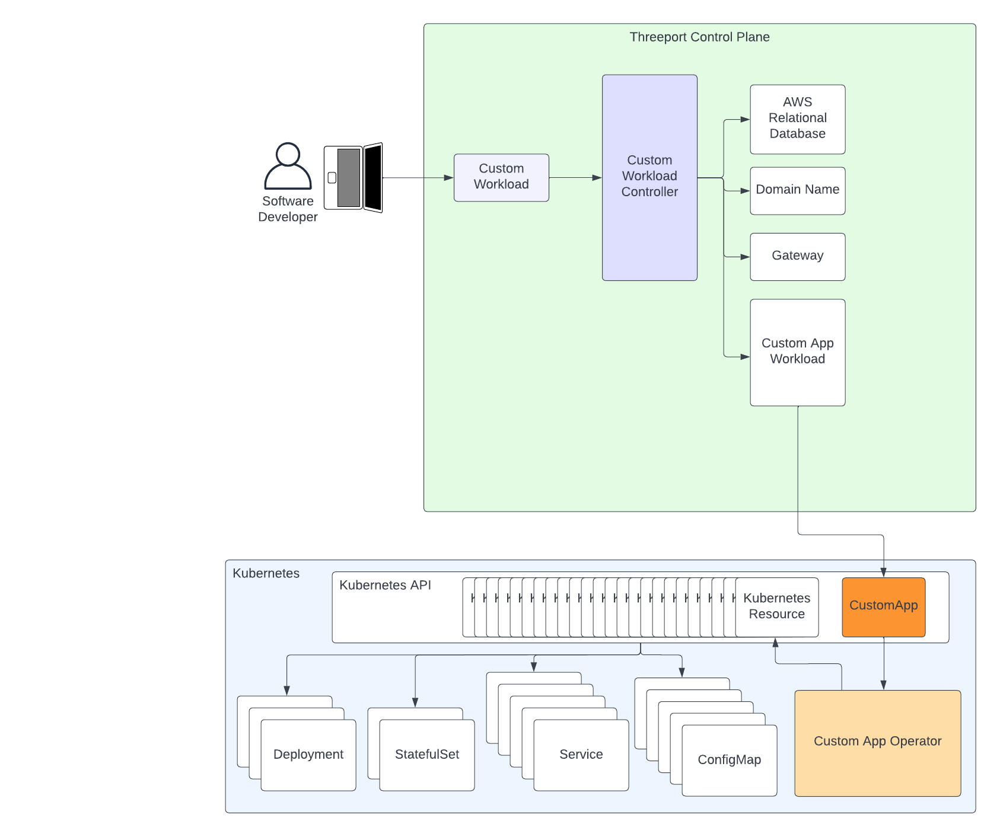

# Threeport Extensions

Threeport provides primitives and systems for managing application delivery.  It
covers a certain number of use-cases but is necessarily limited to generalized
usage.  One system cannot - and _should not_ - provide built-in capabilities for
every custom implementation possible.

For this reason, Threeport provides a Golang SDK to extend the functionality of the
system to any use case imaginable.  The Threeport SDK can be thought of as
a platform engineering framework that is a like Django or Ruby on Rails for building
cloud native application platforms.

> Note: Threeport is written in Go and the SDK currently only supports
> extensions written in the same language.  Because Threeport is built on a
> standard RESTful API, extensions can be written in any language, however, we
> don't currently offer SDKs for any other languages besides Go.

## Custom Application Platforms

Many large enterprises have invested millions of dollars and dedicated large
platform engineering teams to build cloud native application platforms that
serve the purposes of that organization.

This results in the following:

* Many different organizations solve the same sets of problems concurrently with
  limited to no collaboration.
* Great expense is incurred, sometimes without the intended efficiency,
  resiliency and operational outcomes.
* When successful, the resulting platform often solves problems for that
  organization's existing workloads exclusively and is difficult to extend when
  new projects and requirements spring up.
* When platform engineers join an organization, they have limited skill transfer
  from earlier work they've engaged in.  The time-to-productivity is thus
  reduced.
* Conventional platform engineering tools commonly use domain-specific languages
  and not general-purpose programming languages, which further silos platform
  engineering from collaboration with developers.

Threeport exists to solve these problems.  It provides a framework and software
development kit for building custom cloud native application platforms without
starting from scratch.  This enables collaboration between organizations on the
same or similar problem sets, reduces the expense in creating such a platform,
is infinitely extensible by design and allows platform engineers to transfer
their skills between different organizations and implementations built atop
Threeport.

## Example Use Cases

### Primitive Object Abstractions

One way to leverage the SDK is to build abstractions that leverage existing
Threeport objects in the API.  This is useful for moderately complex distributed
applications that use several distinct workloads and a number of managed services
as a part of the app stack.

In this case the custom API object allows users to define complex apps with
relatively few attributes that can be interpreted by the custom controller to
configure the different components appropriately.

In the following example diagram, the application consists of three separate workloads
and several managed services from AWS.  The "Custom Workload" object used by the
dev team provides a simplified abstraction for all the resources needed by that
app.  The reconcilers in the Custom Threeport Controller understand the custom
app's requirements and creates the primitive Threeport objects on behalf of the
developer when instances are deployed.

### Custom Infrastructure Management

In the case that a high-value application leverages cloud provider managed
services not supported by core Threeport, an extension can be built that manages
those services as a part of an app instance deployment.

This example extends the previous to add a controller to manage AWS ElastiCache
and CloudFront instances that are used in the app stack.  We encourage platform
engineers to use the [AWS Go SDK](https://github.com/aws/aws-sdk-go-v2) in use
cases such as this by creating a library for services your organization manages.
We follow a similar approach with the
[aws-builder](https://github.com/nukleros/aws-builder) project that we maintain
to support Threeport.

Platform engineers have other Kubernetes-based solutions that may also be
appropriate such as the [AWS Controllers for
Kubernetes](https://aws-controllers-k8s.github.io/community/docs/community/overview/).

We do not recommend using an infrastructure-as-code solution such as
Terraform or CloudFormation.  These do not offer the flexibility and
sophistication that direct integrations or Kubernetes-based abstractions do.

### Advanced Application Orchestration

This approach is more involved for platform engineering to develop but produces
the best outcome.  It is most appropriate for the highest value
revenue-generating applications, especially those that require a large number of
Kubernetes resources to deploy them.

This approach involves developing a custom [Kubernetes operator](https://kubernetes.io/docs/concepts/extend-kubernetes/operator/)
that is leveraged by Threeport.  It reduces complexity in the Threeport
controller development and offloads much of the workload management logic to
the Kubernetes operator where it is more effective.

In this case, native Threeport objects can be used to provision AWS managed
services, e.g. RDS, as well as support services, e.g. Domain Names and Gateways.
However, by leveraging a Kubernetes operator, the custom Threeport controller
need only create a single Workload object that defines the "CustomApp"
Kubernetes resource, shown in this diagram in dark orange.  On the Kubernetes
cluster, the Custom App Operator, shown in light orange in this diagram, deploys
all of the individual Kubernetes resources in response to that CustomApp
resource being created, updated or deleted.

The advantages to this approach are as follows:

* The logic for managing the application is separated between
  the Threeport controller and the Kubernetes operator.  This division of
  concerns assists in reducing complexity in any single component.  This also
  allows for evolving functionality to be implemented at the correct level:
    * Single in-cluster concerns live in the Kubernetes operator.
    * Multi-cluster concerns such as multi-cluster deployments live in the
      Threeport controller.
* Kubernetes operators maintain a Watch on the custom resources - the CustomApp
  resource in this example - and will make updates to the child Kubernetes
  resources as needed when changes occur to the CustomApp resource.  The
  Kubernetes operator can also ensure that no changes are made directly to those
  child Kubernetes resources and revert them if changes occur.  This is not
  appropriate to do at the Threeport layer.
* Engineering responsibility can be more distributed across distinct concerns.
  As long as the requirements and scope are clearly defined for each component,
  this arrangement works well since there will be two distinct software
  projects:
    * The Threeport controller
    * The Kubernetes operator

The disadvantages:

* There will be two distinct software projects to manage:
    * The Threeport controller
    * The Kubernetes operator
* The implementation for both Threeport controllers and Kubernetes operators need to
  be well understood.
* The API contracts between the two projects need to be maintained and managed
  well.

In summary, the advanced application orchestration approach requires greater
platform engineering expertise and investment, but for high-value applications
with relatively large development teams, the savings in developer toil and
application reliability make the trade-off worthwhile.

## Summary

Threeport extensions provide infinite flexibility in building the application
platform your use-case calls for.  It can be as simple or sophisticated as your
requirements dictate.  It allows platform engineers to leverage the
level-triggered controller pattern already in place with Threeport, saving them
engineering investments in fundamental architecture.  This allows them to focus
on the specific business logic and implementation details they are building for.

## Next Steps

Check out the [Threeport SDK Introduction](../sdk/sdk-intro.md) to get started
building with the Threeport SDK.

