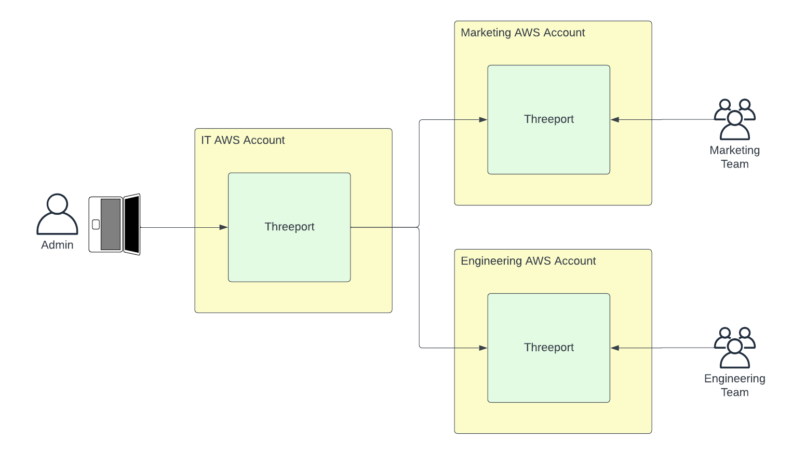

# Control Planes

Control planes in Threeport offer a mechanism to provision new Threeport control
planes using an existing Threeport control plane.

We don't recommend managing multiple Threeport control planes unless you have a
compelling use case for it.  It adds complexity to your systems that you may not
need.

One possible use case is for a large organization with a central IT team that
wants to provide dedicated Threeport control planes to different lines of
business.

This diagram shows a "parent" control plane run by central IT that an Admin uses
to provision new "child" control planes for teams in other parts of the
organization to use.

In this model, central IT can provide Threeport as a service to internal teams,
each with dedicated, segregated Threeport control planes to orchestrate their
applications.

## Control Plane Definition

The definition for a new Threeport control plane allows you to disable auth
(only appropriate for test environments) and gives you the option to register
the parent control plane with the child so the hierarchy is known to each control
plane.

Reference:
[ControlPlaneDefinition](https://pkg.go.dev/github.com/threeport/threeport/pkg/api/v0#ControlPlaneDefinition)

## Control Plane Instance

The control plane instance allows you to nominate the Kubernetes namespace where
the Threeport control plane will be deployed.  Since a Threeport control plane
has a `ControlPlaneInstance` object stored in its database that represents
itself (as distinct from control plane instances that are created separately),
this information is also represented on this object.  This object also records
whether it is a "Genesis" control plane, i.e. was bootstrapped with tptctl
rather than deployed as a child of another Threeport control plane.

Reference:
[ControlPlaneInstance](https://pkg.go.dev/github.com/threeport/threeport/pkg/api/v0#ControlPlaneInstance)

## Next Steps

For more information about Threeport architecture to understand how Threeport
works and how it is bootstrapped, see our [Architecture Overview
document](../architecture/overview.md)

