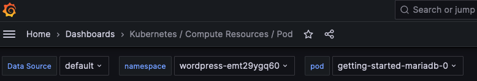
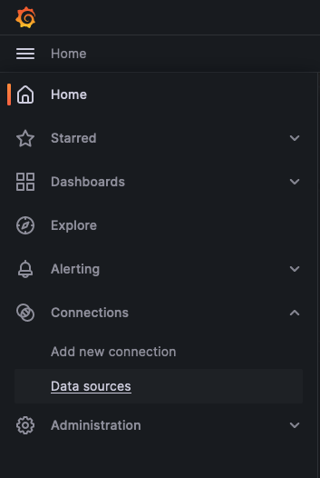
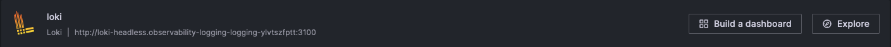
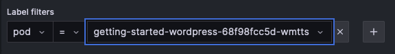
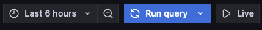

# Deploy Observability Locally

The observability stack provides access to metrics and logging for your
workloads.  This guide walks through the installation and usage of observability
with Threeport.

## Prerequisites

You'll need a local Threeport control plane for this guide.  Follow the [Install
Threeport Locally guide](../install/install-threeport-local.md) to set that up.

You'll also want to deploy a workload to get metrics and logs for.  Follow the
[Deploy Workload Locally guide](../workloads/deploy-workload-local.md) to deploy
a sample WordPress app.

> Note: for this guide, you will need to have
> [kubectl](https://kubernetes.io/docs/tasks/tools/#kubectl) installed at this time.

## Configs

First, create a work space on your local file system:

```bash
mkdir threeport-observability-test
cd threeport-observability-test
```

Download a sample workload config as follows:

```bash
curl -O https://raw.githubusercontent.com/threeport/threeport/main/samples/observability/observability-stack.yaml
```

You now have the config for an observability stack on your file system.  This is
what it looks like.

```yaml
ObservabilityStack:
  Name: observability
  KubernetesRuntimeInstance:
    Name: eks-remote
  MetricsEnabled: true
  LoggingEnabled: true
  # LokiHelmValues: |
  # PromtailHelmValues: |
  # KubePrometheusStackHelmValues: |
  # KubePrometheusStackHelmValuesDocument: kube-prometheus-stack-values.yaml
  # GrafanaHelmValues: |
  #   grafana.ini:
  #     auth.anonymous:
  #       enabled: true
  #       org_role: Admin
```

The commented fields indicate how the observability stack can be customized, but
that is outside the scope of this guide.  We're going to deploy it with the
default settings.

The only change you should make is to set the `KubernetesRuntimeInstance.Name`
field.  Get the name of the K8s runtime instance/s you have available with this
command:

```bash
tptctl get kubernetes-runtime-instances
```

## Create Observability Stack

This command will create all the observability stack components:

```bash
tptctl create observability-stack --config observability-stack.yaml
```

Give Threeport a few minutes to get all the stack components up and running.

You can use this kubectl command to determine when the observability dashboard
is up and running.

```bash
kubectl get po -A -l app.kubernetes.io/name=grafana
```

When the output shows `STATUS: Running` like this, you can proceed.

```bash
NAMESPACE                                                  NAME                                                              READY   STATUS    RESTARTS   AGE
observability-observability-dashboard-grafana-dasjscmzhg   observability-observability-dashboard-grafana-release-6bf4ppg8g   3/3     Running   0          2m55s
```

## Connect to the Dashboard

When running locally, you can connect to the observability dashboard as follows.

First get the namespace for the dashboard:

```bash
DASHBOARD_NAMESPACE=$(kubectl get po -A -l app.kubernetes.io/name=grafana -o=jsonpath='{.items[0].metadata.namespace}')
```

Then, create a port forward to allow you to connect to the dashboard locally:

```bash
kubectl port-forward pod/$(kubectl get po -A -l app.kubernetes.io/name=grafana -o=jsonpath='{.items[0].metadata.name}') 3000:3000 -n $DASHBOARD_NAMESPACE
```

Now visit [http://localhost:3000](http://localhost:3000) in your browser.

This should bring you to the Grafan login.  Enter `admin` for the username and
`password` for the password.

## Metrics

On the left, click on the hamburger menu and navigate to `Dashboards` then `Kubernetes / Compute Resources / Pod`.

At the top of the dashboard, you can select the namespace and pod for which to
view metrics.



Select the namespace with the `wordpress-` prefeix and one of the pods for that
application.  You can view CPU and memory usage, among other metrics, on this
page for the workload.

Click "Home" at the top-left of the screen.

## Logs

To get logs for the WordPress app, click the hamburger menu next to "Home" at
the top-left of the screen.  Then select Connections > Data sources from the
menu.



On the Data sources page, click "Explore" on the loki data source.



On the Explore page, under "Label filters" select "pod" from the "Select label"
menu and select the "getting-started-wordpress" pod from the "Select value"
menu.



Now, click the blue "Run query" button at the top-right of the screen.



You'll now be able to view the logs from the WordPress application.

## Remove Observability Stack

You can now hit ctrl-c to on the port forward to terminate it.

The observability stack can be uninstalled with the following command.

```bash
tptctl delete observability-stack --config observability-stack.yaml
```

## Clean Up

Finally, we can remove the files we downloaded.

```bash
cd ../
rm -rf threeport-observability-test
```

## Summary

In this guide we walked through how to install the observability stack and then
use the dashboard to get basic metrics and log output from the sample Wordpress
application.

