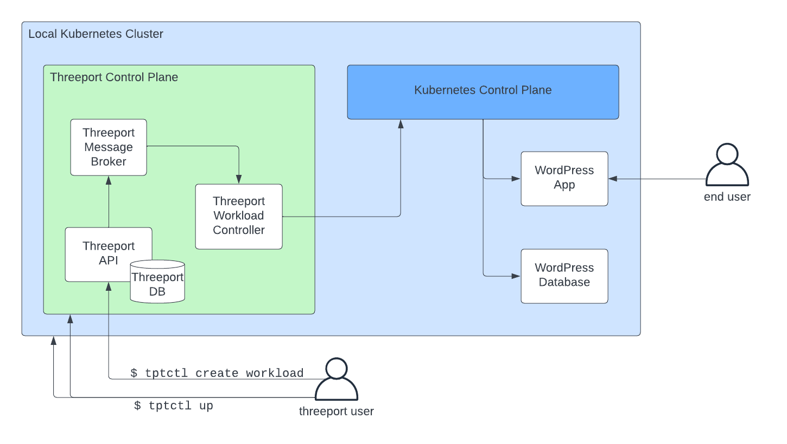

# Deploy Workload Locally

In this guide, we're going to use the simplest possible mechanism to deploy an
app.  It uses a very basic workload config.

## Prerequisites

You'll need a local Threeport control plane for this guide.  Follow the [Install
Threeport Locally guide](../install/install-threeport-local.md) to set that up.

## Configs

First, create a work space on your local file system:

```bash
mkdir threeport-test
cd threeport-test
```

Download a sample workload config as follows:

```bash
curl -O https://raw.githubusercontent.com/threeport/threeport/main/samples/wordpress-workload-local.yaml
```

You now have the workload config on your local file system.  If you open the file you'll
see it has the following fields:

```yaml
Workload:
  Name: "wordpress"
  YAMLDocument: "wordpress-manifest-local.yaml"
```

The `Name` field is an arbitrary user-defined name that must be unique, i.e. no
other workload may use the same name.

The `YAMLDocument` field refers to another file with the Kubernetes resource
manifests.  Download that file as well:

```bash
curl -O https://raw.githubusercontent.com/threeport/threeport/main/samples/wordpress-manifest-local.yaml
```

## Create Workload

We can now create the workload as follows:

```bash
tptctl create workload --config wordpress-workload-local.yaml
```

This command calls the Threeport API to create the Workload objects.
The API notifies the workload controller via the message broker.  The workload
controller processes the workload definition and creates the workload instance
by calling the Kubernetes API.

We can use `tptctl` to view deployed workloads:

```bash
tptctl get workloads
```

Note: the status of the workload will state `Reconciling` or `Down` for a short
time until the workload is running.  It will usually take a minute or two for
the container images to be pulled to start the containers.  Once the Threeport
agent confirms the workload is up, you will see the status become `Healthy`.

We can also use `kubectl` to query the Kubernetes API directly. First, set a local
environment variable to the appropriate namespace for the WordPress application:

```bash
NAMESPACE=$(kubectl get namespace -l control-plane.threeport.io/managed-by=threeport -o=jsonpath='{.items[0].metadata.name}')
```

Confirm the WordPress application is running with:

```bash
kubectl get pods -l app.kubernetes.io/instance=getting-started -n $NAMESPACE
```

If using the kind provider, you can now visit the WordPress application by
forwarding a local port to it with this command:

```bash
kubectl port-forward svc/getting-started-wordpress 8080:80 -n $NAMESPACE
```

Now visit the app [here](http://localhost:8080).  It will display the welcome screen of
the WordPress application.

## Namespace Management

You may have noticed the Kubernetes manifest does not include a namespace
resource for the sample WordPress app.  This is the recommended way to deploy
workloads with Threeport.  If you don't supply a namespace, Threeport will
manage namespaces for you, allowing you to seamlessly deploy multiple instances
of a workload to a particular Kubernetes cluster.

## Summary

This diagram illustrates the relationships between components introduced in this
guide.



When we installed Threeport using `tptctl up` we created a new
control plane on a new Kubernetes cluster.

When we installed the sample app using `tptctl create workload` we called the Threeport
API to create the workload.  The reconciliation for these objects was carried
out by the workload controller which created the necessary Kubernetes resources
via the Kubernetes control plane.

While this approach doesn't provide any special outcomes that you could not have
achieved with other tools, it does do something unique under the hood.  It
manages Kubernetes workloads using a workload abstraction and the corresponding
controller that enables the following:

* Support Service Dependency Management: Installing and configuring support
  services such as ingress, TLS termination, DNS management and more.
* Cloud Provider Service Dependency Management: Calling cloud providers on your
  behalf to spin up managed services such as S3 and RDS that your app relies on.

To see these features in action, see our guides on installing Threeport in AWS
and deploying workloads there.

## Clean Up

To delete a workload:
```bash
tptctl delete workload --config wordpress-workload-local.yaml
```

To uninstall the Threeport control plane locally:

```bash
tptctl down control-plane -n test
```

Remove the test configs from you file system:

```bash
cd ../
rm -rf threeport-test
```

## Next Steps

Next, we recommend you try out Threeport on AWS.  See our [Install Threeport on
AWS guide](../install/install-threeport-aws.md) for instructions.

