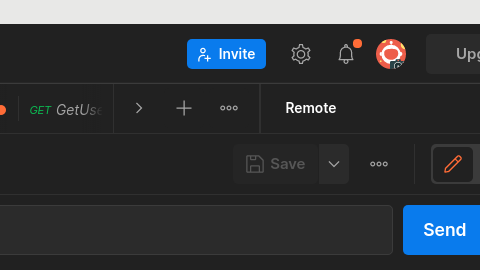
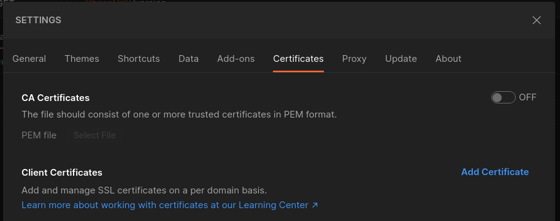
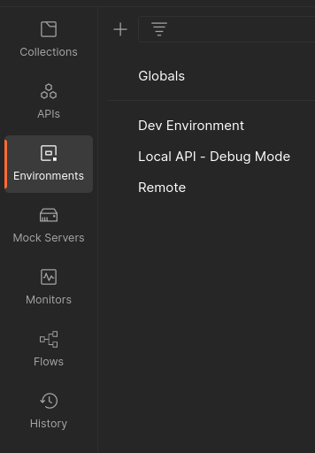
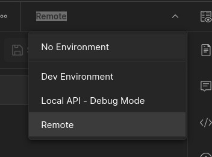

# Postman with Remote Threeport Instances

If using Postman to do dev and testing on a remote threeport instance with auth
enabled, follow these instructions to set it up.

These instructions assume you have a threeport config that contains the
credentials to the threeport instance, such as if you used `tptctl create
control-plane` to provision it.

## Generate Creds

Build the tptdev tool:

```bash
make build-tptdev
```

Use that tool to get the credentials:

```bash
./bin/tptdev get-creds -n <threeport instance name>
```

This will write the CA, client cert and key to your working directory.

## Import into Postman

Click the cog icon at the top-right of the Postman client and select "Settings."



In the Settings window, select the "Certificates" tab.  Then click "Add
Certificate."



For the "Host" enter the hostname for the remote endpoint.  If a cloud provider
load balancer is used, you can get that value as follows:

```bash
kubectl get svc -n threeport-control-plane threeport-api-server -o jsonpath='{.status.loadBalancer.ingress[0].hostname}'
```

For "CRT file" select the file generated by `tptdev` called `[instance
name]-client.crt`.

For the "KEY file" select the file generated by `tptdev` called `[instance
name]-client.key`.

Click "Add."

## Set Postman Environment

On the left panel, select "Environments."



Select an existing environment or create a new one.

For the "baseURL" variable add or update the "CURRENT VALUE" to
`https://[hostname]`.  This is the same hostname as entered for the host in the
Certificates section (minus the protocol).

Now, when making calls to an endpoint, select the environment from the drop-down
at top-right.



