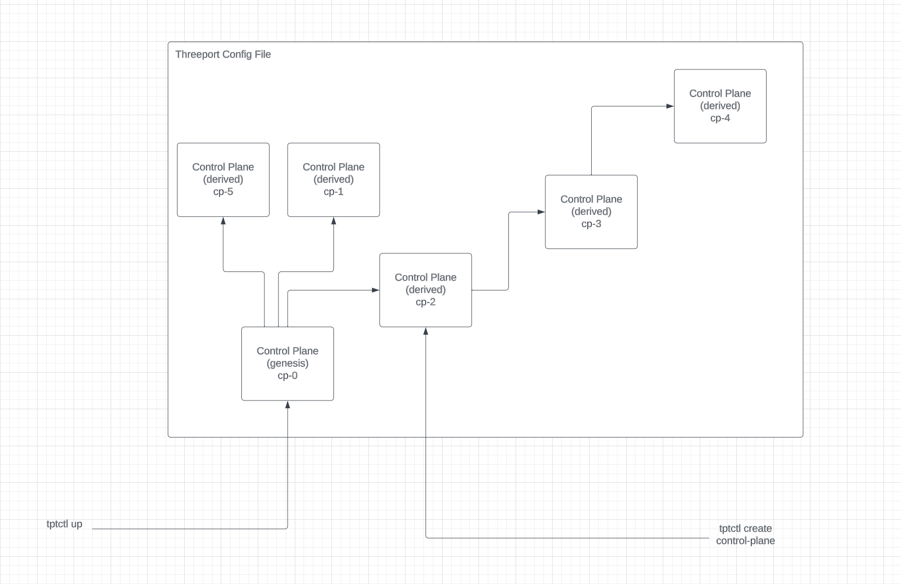

# Threeport Config
Your threeport config is a file that is used with tptctl and contains information that allows for connection to the control plane.
It is an optional flag to a file path for most `tptctl` commands.

The threeport config is considered a logical container for a group of control planes.
Since control planes can be deployed and managed by other control planes via the control plane
API, a tree like relationship exists between those managed by one another.
The root of this tree is considered the genesis control plane. The diagram below helps to better illustrate this idea:

In the above diagram, `cp-0` is a control plane that is the genesis control plane and is managing other control planes
which in turn can be managing others. All other control planes apart from the genesis are created via the control plane API.

When a new control plane is spun up using `tptctl up`, you are orchestrating the creation
of a control plane that is considered a genesis control plane within a new group. Hence if the 
provided config file contains control planes within them, it will be considered
already populated with a previous control plane group, throwing back an error prompting you to choose 
a different empty config file.

Similiarly, `tptctl down` can only be used to spin down a control plane that is a genesis control
plane within the group. Before removing the genesis control plane, you should delete control
planes from the leaves to the root i.e. every parent control plane that is responsible for other control planes
should reconcile their deletion before being deleted themselves by their own parent.
The genesis control plane can thus be brought down with `tptctl down` once the process reaches the root.