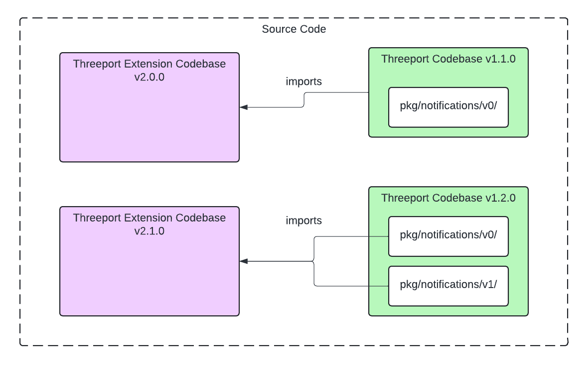
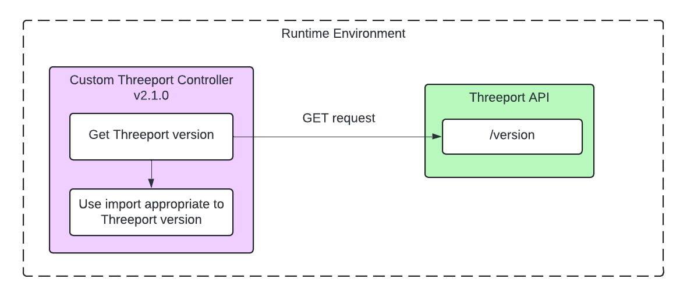
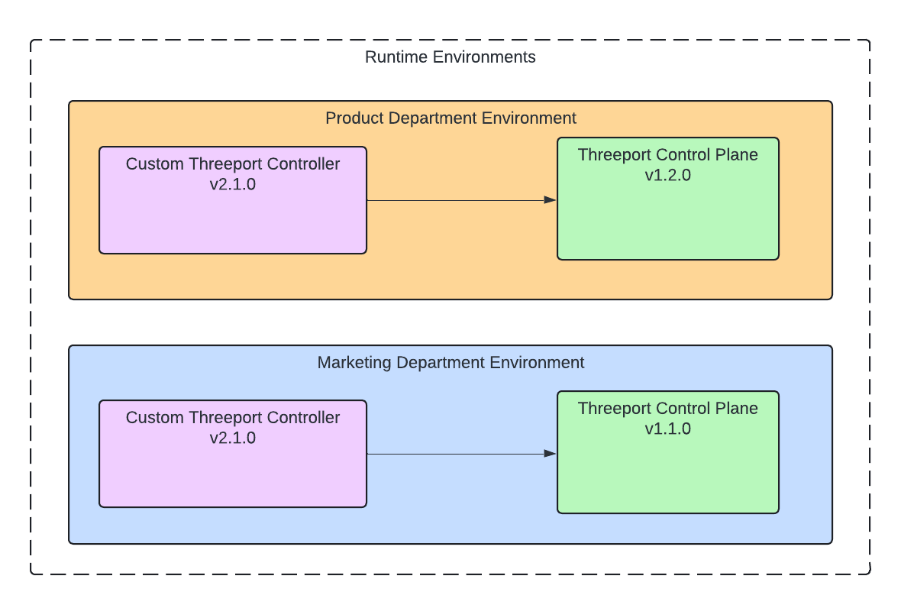

# Versions

There are two primary versioning systems in Threeport:

* API object versions
* Library versions

In some packages there is a mix of the two.  Take `pkg/api-server` as an
example:

```
pkg/api-server
├── README.md
├── lib
│   └── v0
├── v0
│   ├── handlers
│   ├── routes
│   ├── tagged_fields_gen.go
│   └── versions
└── v1
    ├── handlers
    ├── routes
    ├── tagged_fields_gen.go
    └── versions
```

In `pkg/api-server/lib/v0` you will find a *versioned library*.  This lib contains
general-purpose functions that manage Threeport API functionality that is
independent of any API object versions.

In `pkg/api-server/v0` you will find API server handlers, routes and version
functionality that serves a particular *API object version*.

So when you see a `lib` sub-package` that is using library versioning.  The
adjacent versions are object versions.

## API Object Versioning

API object versioning in Threeport is pretty conventional and follows general
standard practices.

The core purpose of API object versioning is to ensure that integrations are not
broken with changes in the project.  Versioning is used to maintain backward
compatibility while being able to add new features that can be optionally used
by Threeport users and their integrations.

Each API object in Threeport is versioned.  When non-backward compatible changes
need to be made to an API object, they must be made to a new version of that
object that is  added to the API.  Non-backward compatible changes include:

* Removing a field from the object
* Adding a new required field to the object
* Chaning the data type for an existing field

Adding a new optional field to an object usually will not break backward
compatibility.

In future we will add policies around support for backward compatibility,
deprecating old versions and removing them to give users time to update their
integrations to new object versions.

### Object Version Hierarchy

The object versioning hierachy is expressed differently in different places.

In Threeport, API objects are broken into groups.

* All objects in a group are defined in a single file, e.g.
  `pkg/api/v0/workload.go` contains several workload objects.
* All objects in a group are managed by a single controller.
    * Each object has a reconciler that runs within the object groups
      controller.  This is sometimes also referred to as a controller domain.

The hierachy that expresses the relationship between object groups, objects and
each object's version is structured differently in different places:

* SDK config: The SDK config is used by Threeport devs and Threeport extension
  developers to define the objects in the system.  The object version hierachy
  is as follows in the SDK config:
  ```
  Object Group
  |-- Object
      |-- Versions
  ```
  See the `sdk-config.yaml` for examples.
* Codebase: In `pkg/api` of the Threeport codebase and its extensions, the object
  version hierachy is as follows:
  ```
  Version
  |-- Object Group
      |-- Object
  ```
  See `pkg/api` in this codebase for examples.
* API Endpoints: The REST paths that are exposed by the REST API to allow users to
  create, update and delete objects uses the following object version hierachy:
  ```
  Version
  |-- Object
  ```
  Object groups are not expressed in the REST paths.  See the path constants in
  `pkg/api/v0/workload_gen.go` for examples such as `/v0/workload-definitions`.

## Threeport Library Versioning

Threeport has many packages that can be imported by projects that integrate with
Threeport.  In Threeport, we version these libraries to maintain compatibility
with software integrations (as opposed to REST API integrations).  This is not
particularly common, but we feel it is important.

### Lib Versioning Rationale

If you have ever upgraded the versions of your Go library dependencies and had
that break the code you've written that uses the library, you'll appreciate why
we did this.

We run into this pretty often.  It usually goes as follows:

1. Upgrade depeendencies with `go get -u ./...`.
1. New library versions are downloaded and recored in `go.mod`.
1. Re-build project components and find compile errors.
1. Find library function signatures that have changed and update library usage in
   local project.  On occasion, a function has been entirely removed and we find
   the fix too troublesome and revert to an earlier version of the library so
   our code still works.

In Threeport, we use library versioning to prevent this.

Let's take the following Threeport package as an example:
`pkg/notifications/v0/`.  In `notifications.go` there are some constants, a
`Notification` type and a `ConsumeMessage` function.  If we change any of the
constants, the attibutes of the `Notification` object, or the function signature
for `ConsumeMessage`, any other Go project that imports this package may
break when they upgrade to the latest version of Threeport as an imported
library.

To prevent this, if we make a breaking change, we create a `v1` version of the
package and make the breaking changes there.

Now, projects importing the `v0` package can upgrade their `go.mod` to the
latest version of Threeport, including any bug fixes that may have been applied
to that version and continue without breakage.

If there is a feature or functionality they wish to use in `v1` they can make
that upgrade with the import path in their code - but the version of Threeport
recorded in `go.mod` does not need to change.

### Get to the Point!

We want to make upgrade paths as smooth as possible.

With this library versioning, your extensions and integrations with Threeport
are able to readily maintain compatibility with multiple versions of Threeport
simultaneously.

Let's say that a new version of `pkg/notifications` is introduced with v1.2.0 of
Threeport and is used internally in the Threeport control plane.

You want to upgrade your Threeport custom controller to be compatible with the
latest v1.2.0 of Threeport.  However, you'd also like it to be compatible with
the existing version of Threeport you have in use.  Otherwise, you have
to juggle compatibility by mapping versions of your project to different
versions of Threeport.  That can become messy quickly.

You can import both packages from Threeport into the latest version of your
Threeport extention.



Now, in your runtime environment, your controller can all the Threeport API
`/version` endpoint to determine the version of Threeport it's working with and
use the appropriate notifications library when dealing with notifications.

The source code would look something like:

```go

import (
	tpnotif_v0 "github.com/threeport/threeport/pkg/notifcations/v0"
	tpnotif_v1 "github.com/threeport/threeport/pkg/notifcations/v1"
)

switch tpVersion {
case "v1.1.*":
	notif, err := tpnotif_v0.ConsumeMessage(message)
	if err != nil {
		return err
	}
case "1.2.*":
	notif, err := tpnotif_v1.ConsumeMessage(message)
	if err != nil {
		return err
	}
}
```

The runtime environment behavior would be something like this when handling
notifications:



Now, if you have multiple environments with different versions of Threeport, you
can run the same version of your Threeport controller.



