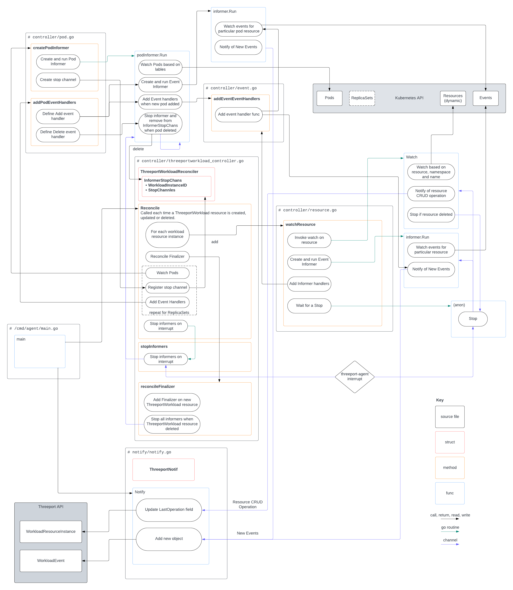

# internal/agent

This package contains the logic for the threeport agent.  It is a Kubernetes
controller, AKA Kubernetes operator.  It's purpose is to consume ThreeportAgent
custom resources and use those to determine which Kubernetes resources
constitute a threeport workload instance so that those resources may be watched.
[Kubernetes
Events](https://kubernetes.io/docs/reference/kubernetes-api/cluster-resources/event-v1/)
for those resources are also captured and sent to the Threeport API for use by
Threeport controllers and end-users.

The following diagram illustrates the functionality that belongs in each source
file along with the interactions with the external APIs.  The blue function
boxes that aren't inside a black source file box belong to imported libraries.

